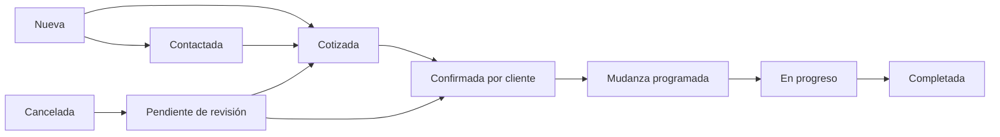

## Context

Este cambio documenta el MVP de **LM Rapid Transport**. El usuario autorizó análisis y artefactos OpenSpec, no implementación. El repositorio inspeccionado contiene un README de prueba, configuración de OpenSpec y skills; no hay aplicación ni migraciones existentes.

Las aclaraciones posteriores sustituyen el alcance original donde hay diferencias: solo Seenode, email del cliente opcional, tarifas con impuestos incluidos, sin descuentos/cargos extra/objetos especiales, permisos ampliados para DISPATCHER, fechas flexibles y confirmación manual. La URL y clave pública de Supabase compartidas en la conversación no se copian a los artefactos; se usarán variables de entorno en la implementación.

Los requisitos verificables están en los ocho archivos `specs/*/spec.md`. Las decisiones técnicas y transiciones propuestas aquí concretan lo no especificado; no representan funciones ya construidas.

## Goals / Non-Goals

**Goals:**

- Dos aplicaciones Next.js mantenibles, responsive y bilingües, con español por defecto.
- Recepción pública segura y operación administrativa completa desde solicitud hasta importe final.
- Reglas de precios reproducibles y permisos modificables en futuras iteraciones por acción.
- Bajo costo: dos servicios de aplicación, un proyecto Supabase y un proveedor SMTP de autenticación.
- Ejecución local documentada, migraciones reproducibles, seed ficticio y validaciones por fase.

**Non-Goals:**

- NestJS, aplicación nativa, Expo, microservicios, ORM adicional, pagos/Stripe, contabilidad, nómina, IA, analytics avanzados, GPS, optimización de rutas o seguimiento de camiones.
- PDF, SMS o envío automático de cotizaciones y avisos de operación. Se incluyen exclusivamente correos de autenticación.
- Embalaje/desembalaje, objetos especiales y sus cargos, descuentos, peajes u otros cargos adicionales.
- Asignación de trabajadores o camiones específicos, capacidad automática, múltiples paradas y fusión de clientes.
- Editor de roles/permisos, activación de MOVER/DRIVER, historial general de todos los campos, portal del cliente y consultas públicas de solicitudes.
- Vercel como destino de entrega, compra/configuración de dominio o ejecución de migraciones remotas durante esta etapa.

## Decisions

### 1. Monorepo y límites de responsabilidad

```text
apps/
  web/           Next.js App Router: sitio, formulario y endpoints de recepción
  admin/         Next.js App Router: autenticación, consultas y acciones administrativas
packages/
  ui/            Tailwind + componentes shadcn/ui + estados accesibles
  types/         Tipos de dominio y Database generado desde Supabase
  validation/    Zod y funciones puras de precios/transiciones
  config/        TypeScript estricto, configuración compartida y entorno tipado
  data/          Clientes Supabase, consultas y llamadas RPC; imports server-only
supabase/
  migrations/    Schema, permisos, funciones, políticas y tarifas iniciales
  seed.sql       Escenarios de desarrollo, separados de los datos reales
```

Bun gestiona workspaces, lockfile y pruebas unitarias; Turborepo coordina tareas. Node ejecuta Next.js en producción. Las versiones compatibles se verifican al comenzar la implementación y se fijan mediante lockfile. Server Components realizan lecturas; Server Actions/Route Handlers validan y ejecutan mutaciones. React Hook Form y Zod cubren formularios. No usar una capa HTTP interna entre las aplicaciones ni repetir reglas de negocio por pantalla.

Se añade `packages/data` a los cuatro paquetes pedidos porque dos aplicaciones comparten Supabase. Las reglas puras pequeñas permanecen en validation; no se crea un framework de dominio ni repositorios abstractos. Un backend separado u ORM duplicaría autenticación, modelos y despliegues sin necesidad actual.

### 2. Idioma, identidad y alcance territorial

- Español inicial, selector inglés/español con preferencia persistida. Diccionarios compartidos y etiquetas de estados traducidas; códigos persistidos estables.
- Nombre comercial LM Rapid Transport. Logo, colores y datos de contacto pendientes. Ejemplos identificados en desarrollo; publicación requiere reemplazarlos. No inventar reseñas, licencias, certificaciones, antigüedad ni cifras comerciales.
- Servicios: mudanzas residenciales, de oficinas y locales comerciales. Sin embalaje/desembalaje.
- Origen y destino deben estar en Florida, Estados Unidos. Solo un origen y un destino.
- LOCAL cuando ambos están dentro de los límites municipales de la **ciudad de Miami**, no todo Miami-Dade. Si cualquiera queda fuera, PER_MILE. El personal confirma la clasificación manualmente; el texto postal «Miami» no demuestra pertenencia al municipio. No geocodificación ni cálculo de rutas en este MVP.
- Teléfono obligatorio estadounidense normalizado a E.164. Usar validación con metadatos de región; `+1` por sí solo no prueba que sea de EE. UU. No se verifica propiedad del número mediante SMS.
- Email opcional. Fechas/calendario en `America/New_York`; instantes operativos en `timestamptz`, presentación con zona de Miami. USD y magnitudes ft²/m² con unidad explícita.

### 3. Tarifas y cálculo

| Modalidad | Equipo | Tarifa inicial |
|---|---|---|
| LOCAL | 2 trabajadores + camión | 119 USD/h |
| LOCAL | 3 trabajadores + camión | 145 USD/h |
| LOCAL | 4 trabajadores + camión | 165 USD/h |
| PER_MILE | Cualquiera de los equipos de 2/3/4 + camión | 4 USD/milla de ida |

Tarifas con impuestos incluidos. No desglosar ni sumar impuestos, camión, trabajadores, viaje, cargos extra o descuentos. Las tarifas locales son por equipo: **no multiplicar otra vez por trabajadores**. Residencial y comercial comparten tarifas ahora; el tipo de propiedad se guarda para permitir diferenciarlas después.

Mínimo local inicial común: 3 horas. ADMIN y MANAGER editan tarifas generales y mínimo general. Las cotizaciones copian tarifa, equipo y mínimo como valores propios; cambiar el tarifario no las actualiza retroactivamente. No añadir un editor individual de mínimo en esta iteración: la autorización acordada cubre su configuración general.

```text
horas_facturables = max(minimo_horas_copiado, ceil(duracion_en_segundos / 3600))
total_local = horas_facturables * tarifa_horaria_copiada

millas_facturables = ceil(millas_ida)
total_fuera_miami = millas_facturables * tarifa_por_milla_copiada
```

El mínimo configurado será un entero positivo. Duraciones y millas deben ser positivas y tener límites explícitos de validación; no aceptar NaN, infinito o negativos. Dinero en centavos enteros; distancia decimal en PostgreSQL numeric. El servidor/DB recalcula importes, no acepta el total enviado por el navegador. Las funciones puras de vista previa y la implementación SQL tendrán fixtures de paridad para prevenir divergencias.

Estimación local: duración estimada introducida por el personal. Medición real: llegada al origen hasta finalizar la descarga, incluyendo tránsito origen-destino y pausas; excluir viaje desde/hacia base. Guardar fecha y hora completas para cruces de medianoche. Estimación por millas y millas reales introducidas manualmente, solo ida entre origen y destino. No mínimo de millas. Ejemplos: 3 h 40 min → 4 h; 125.4 millas → 126 millas → 504 USD. El estimado conserva su identidad aunque haya total final.

### 4. Roles y permisos por acción

Definir un catálogo estable de acciones y una asignación inicial de acciones a roles en tablas privadas, modificable con migraciones futuras. La autorización de DB es fuente de verdad; Next.js consulta los mismos permisos para autorizar y mostrar controles. No confiar en roles provenientes de formularios o metadata editable por el usuario. Un perfil inactivo pierde acceso aunque conserve un token de sesión.

| Acción | ADMIN | MANAGER | DISPATCHER |
|---|:---:|:---:|:---:|
| Ver todos los clientes, solicitudes, cotizaciones y mudanzas | Sí | Sí | Sí |
| Editar contactos, direcciones, equipo de 2/3/4 y datos operativos | Sí | Sí | Sí |
| Crear/editar/aprobar cotizaciones individuales y tarifa por hora/milla | Sí | Sí | Sí |
| Registrar comunicación y confirmación manual del cliente | Sí | Sí | Sí |
| Programar/reprogramar, iniciar, completar, cancelar y reactivar | Sí | Sí | Sí |
| Registrar/corregir tiempos y millas antes de completar | Sí | Sí | Sí |
| Corregir tiempos, millas o tarifas después de completar | Sí | Sí | No |
| Ver historial de horas, millas y tarifas | Sí | Sí | Sí |
| Crear/editar/eliminar cualquier nota interna | Sí | Sí | Sí |
| Modificar tarifas generales y mínimo general | Sí | Sí | No |
| Crear/desactivar usuarios MANAGER y DISPATCHER | Sí | Sí | No |
| Gestionar cuentas ADMIN | Sí | No | No |
| Eliminar definitivamente clientes/solicitudes/mudanzas | No | No | No |

Los permisos de aprobación y edición de DISPATCHER son configuración del MVP, no condiciones dispersas e inmutables en cada pantalla. MOVER/DRIVER quedan previstos mediante el modelo, sin cuentas operativas ni permisos. El cambio de rol y cualquier ruta de gestión de usuarios deben aplicar las mismas restricciones de rol destino y rol actual, evitando que MANAGER se promueva a ADMIN o altere indirectamente una cuenta ADMIN. Como protección técnica propuesta, impedir desactivar al último ADMIN activo.

Invitación: ADMIN/MANAGER introduce email y rol autorizado; una operación server-only llama a Supabase Auth Admin y crea un perfil restringido. Solo el destinatario valida el enlace y establece contraseña. Recuperación mediante enlace de Supabase. No registro público ni contraseña enviada por email. Configurar SMTP propio de autenticación y redirecciones permitidas; autorizar el perfil antes de permitir datos. Si la invitación/perfil falla parcialmente, reintento controlado y ninguna cuenta obtiene acceso por defecto. Activación, desactivación y gestión de sesiones deben comprobarse en integración.

### 5. Modelo relacional propuesto

Todas las entidades mutables usan UUID, created_at y updated_at. FK/indexes sobre asociaciones y campos de filtros; restricciones en DB además de Zod. El historial append-only tiene created_at y actor, sin edición/eliminación ordinaria.

| Tabla | Propósito y restricciones principales |
|---|---|
| profiles | id = auth.users.id, nombre, rol, active; sin autoedición de privilegios |
| private.role_permissions | rol + acción únicos; configuración sin editor público |
| customers | nombre/apellido, phone_e164 único, email nullable; sin borrado ordinario |
| addresses | Campos de dirección, unidad/apartamento, ciudad, estado FL, ZIP y país US; snapshots de solicitud |
| moving_requests | customer_id, número único, snapshot de contacto, dos addresses, fecha deseada nullable, tipo, dormitorios residenciales, superficie/unidad opcional, pisos/elevadores, equipo nullable, comentarios, status y version |
| attachments | request_id, ruta de objeto privada única, tipo/tamaño, nombre mostrado saneado; máximo ocho |
| pricing_settings | Tres tarifas locales, tarifa por milla y mínimo común; actualizadas con permiso explícito |
| quotes | request_id único, modo, equipo, tarifa/minimo copiados, duración/millas estimadas, total estimado y estado; version/terms_version |
| quote_communications | Cotización y versión, snapshot de términos comunicados/confirmados, medio PHONE/WHATSAPP/EMAIL, fecha, actor, respuesta y confirmed_at; comunicación manual, sin envío externo |
| moves | request_id único, customer_id, direcciones asociadas a la solicitud, scheduled_at, estado, notas, duración estimada, started_at/finished_at reales, millas reales, total final y version |
| notes | request_id, texto, autor; CRUD por los tres roles |
| pricing_change_history | Entidad/campo, valor anterior/nuevo, actor y fecha; solo cambios de tiempos/horas, millas y tarifas; sin motivo obligatorio |
| private.intake_sessions | Token hash, caducidad, idempotencia, archivos provisionales y request result para reintentos públicos |
| private.rate_limits | Contadores atómicos con caducidad y claves no reversibles para recepción/subidas |

No crear `request_items`: se aplazaron los objetos especiales. No añadir tablas de camiones, asignaciones, pagos ni rutas. Las notas de Move pueden usar un campo editable separado y las notas internas de la solicitud se muestran desde la relación; no duplicar cronologías.

Clientes: buscar por teléfono normalizado y crear/asociar en una transacción con índice único, incluso bajo concurrencia. Una coincidencia reutiliza el cliente sin cambiar nombre/email existentes; los datos enviados permanecen en el snapshot de solicitud. Email solo ayuda a revisión/búsqueda, no fusiona automáticamente teléfonos distintos. No mostrar al público si existe el teléfono. Si el personal cambia el teléfono a uno ya usado, mostrar conflicto y no fusionar. Editar un contacto no reescribe snapshots históricos de otras solicitudes.

Cambios de direcciones sincronizan la mudanza asociada mediante operación transaccional; no modificar silenciosamente otras solicitudes del cliente. Si cambia LOCAL/PER_MILE, invalidar aprobación/confirmación de términos y exigir revisión y nueva confirmación antes de continuar normalmente.

### 6. Estados y consistencia

Los códigos siguientes concretan los nombres acordados. Se propone incluir CANCELLED en cotizaciones para materializar su cancelación explícita; no existe expiración automática.

| Entidad | Estados |
|---|---|
| Solicitud | NEW, CONTACTED, QUOTED, CONFIRMED, IN_PROGRESS, COMPLETED, CANCELLED, PENDING_REVIEW |
| Cotización | ESTIMATED, ACCEPTED, CONFIRMED, CANCELLED |
| Mudanza | SCHEDULED, IN_PROGRESS, COMPLETED, CANCELLED, PENDING_REVIEW |



Transiciones propuestas y condiciones:

- NEW → CONTACTED/QUOTED/CANCELLED; CONTACTED → QUOTED/CANCELLED. Crear cotización mueve a QUOTED.
- QUOTED → CONFIRMED únicamente tras confirmación registrada de términos vigentes. Puede cancelarse.
- CONFIRMED → IN_PROGRESS al iniciar la Move programada; → QUOTED si se invalidan términos; → CANCELLED si se cancela.
- IN_PROGRESS → COMPLETED al cerrar mediciones y calcular total; → CANCELLED si se cancela. No permitir una edición arbitraria del estado saltarse condiciones.
- CANCELLED → PENDING_REVIEW, nunca al estado anterior directamente. PENDING_REVIEW → CONTACTED/QUOTED/CONFIRMED después de revisión y según cotización válida; también → CANCELLED.
- Crear Move desde una solicitud CONFIRMED requiere fecha/hora acordadas y cotización confirmada; relación única. La solicitud sigue CONFIRMED mientras la Move está SCHEDULED.
- Move: SCHEDULED → IN_PROGRESS/CANCELLED; IN_PROGRESS → COMPLETED/CANCELLED; CANCELLED → PENDING_REVIEW; PENDING_REVIEW → SCHEDULED/CANCELLED con revisión, fecha/hora válidas y condiciones de confirmación satisfechas. Reusar la misma Move al reactivar.
- Completar Move actualiza solicitud a COMPLETED; cancelar cualquiera de las dos cuando hay relación cancela ambas y suspende la cotización. Reactivar ambas mantiene PENDING_REVIEW y exige revisar antes de confirmar/programar. El motivo de cancelación es opcional; conservar su último registro no implica un historial genérico de todos los cambios.
- Cotización: ESTIMATED → ACCEPTED por cualquiera de los tres roles; ACCEPTED → CONFIRMED tras comunicación/confirmación manual. Cancelación → CANCELLED; revisión tras reactivación → ESTIMATED. Modificar tarifa, mínimo contractual, equipo tarifado o modalidad invalida confirmación y devuelve a ESTIMATED. Notificar nuevamente la versión aprobada antes de confirmarla.
- Las cotizaciones no caducan por tiempo. ACCEPTED sin comunicación no cuenta como pendiente de respuesta del cliente.
- No duplicar una Move ni su cotización por reintentos. Propuesta: COMPLETED no regresa al flujo operativo; las correcciones posteriores son acciones explícitas ADMIN/MANAGER sobre la misma entidad.

El cliente confirma tarifa/modalidad/equipo y mínimo, no un total fijo. Cambiar horas/millas reales recalcula total sin requerir una nueva aceptación de tarifa. Si ADMIN/MANAGER cambia una tarifa tras COMPLETED, mantener el trabajo completado pero marcar términos pendientes de nueva confirmación; conservar el cierre previo hasta registrar la nueva aceptación. No dejar silenciosamente un nuevo total como final confirmado. Estados de trabajo y confirmación comercial son dimensiones distintas.

Una reconfirmación comercial no debe hacer retroceder una solicitud IN_PROGRESS o COMPLETED a CONFIRMED. Si una Move todavía SCHEDULED pierde confirmación comercial, se conserva la reserva de fecha/hora pero se impide iniciar hasta reconfirmar. Si el trabajo ya comenzó, se conserva su estado operativo y la última versión aceptada para distinguir importes acordados de cambios pendientes. Los snapshots de términos en las comunicaciones permiten reconstruir exactamente lo comunicado sin convertir el historial en una auditoría general.

Las funciones transaccionales verifican actor, permisos, estado y versión esperada. Con bloqueo de fila y control optimista, una edición concurrente obsoleta devuelve conflicto en vez de sobrescribir datos nuevos. El historial de cantidades/tarifas se inserta en la misma transacción. Las notas, estados, contacto, dirección y programación no tendrán historial general por decisión del usuario.

### 7. Programación y tiempos

- Solicitud pública: fecha opcional; si se indica, debe ser posterior al día actual de Miami y de lunes a sábado. Mañana es válido aunque falten menos de 24 horas; si es domingo, la primera opción es lunes.
- La hora se acuerda después. Para programar/reprogramar: fecha y hora obligatorias, lunes-sábado, cualquier hora acordada; validar que la cita no sea pasada. Propuesta técnica: los cambios de una cita existente pueden ser para hoy si todavía es una hora futura; la prohibición de solicitudes nuevas para hoy se mantiene.
- Sin bloqueo de coincidencias: pueden existir varias mudanzas a la misma hora. Sin asignaciones individuales o control de capacidad.
- Reprogramar no invalida confirmación comercial y no exige nueva respuesta del cliente. Sí la invalida un cambio de tarifa o modalidad.
- Registrar inicio/final reales con fechas, evitando interpretar 01:00 del día siguiente como anterior a 23:00. Resolver horas ambiguas de cambios de horario con offset explícito en el formulario/servidor.

### 8. Recepción pública, fotografías y seguridad

Ningún visitante puede leer tablas, listar clientes, buscar números de solicitud o recuperar fotografías. El número es referencia de atención, no credencial de acceso. `anon` no tiene DML ni EXECUTE general sobre funciones operativas.

Endpoint Next.js valida schema, origen permitido para operaciones del navegador, tamaño de cuerpo y límites persistentes contra abuso antes de usar un cliente privilegiado server-only. Las claves elevadas no se usan para operaciones normales del admin; estas usan sesión y RLS. La publishable key no puede ejecutar migraciones ni suplir credenciales administrativas.

Propuesta de carga para evitar un único multipart de 40 MB y simplificar reintentos:

1. Validar el formulario y crear una sesión de recepción breve con token aleatorio almacenado como hash, no una solicitud visible a operaciones.
2. Subir cada foto mediante endpoint server-side acotado a 5 MiB por archivo, ocho por sesión y 40 MiB total. Comprobar tipo real/decodificación, tamaño y dimensiones máximas; rechazar SVG, ejecutables, archivos corruptos y discrepancias de extensión. Generar rutas aleatorias; no usar nombres del usuario como ruta.
3. Finalizar con token e idempotency key; una transacción asocia cliente, direcciones, solicitud y metadatos, y devuelve solo request number. No mostrar éxito antes de confirmar la transacción. Reintentos devuelven el mismo resultado; no hay endpoint de lectura pública posterior.
4. Un proceso de mantenimiento documentado elimina sesiones/objetos provisionales caducados. Si falla una foto, permitir reintentar u omitirla explícitamente antes de enviar. Nunca perder archivos silenciosamente ni dejar una solicitud visible incompleta.

Bucket privado, URLs firmadas cortas generadas tras autorización del personal y políticas de Storage restrictivas. Si se elimina un provisional, comprobar prefijo y pertenencia a sesión. Fotos definitivas no son públicas ni se sirven mediante URLs permanentes.

Mantener cuotas en PostgreSQL en lugar de memoria por instancia; registrar únicamente claves hash y caducidades. Verificar qué cabecera de IP entrega Seenode antes de confiar en ella, impedir falsificación y añadir límite global. Honeypot y límites son base; un desafío antiabuso puede activarse si lo requiere la exposición real. Los valores concretos de cuotas se documentan como configuración técnica y se prueban.

Tablas de negocio: RLS en todas las expuestas; SELECT restringido a perfiles activos con permiso. Mutaciones mediante RPC de operaciones, sin DML directo amplio que permita saltarse estados/historial. Preferir invoker donde sea viable; las funciones definer necesarias fijan search_path vacío, objetos calificados, EXECUTE mínimo y verifican `auth.uid()`/permisos internamente. Las funciones de recepción privilegiada no se conceden a anon/authenticated. Probar también REST/RPC directo, no solo interfaz.

### 9. Dashboard y experiencia

Panel con sidebar responsive, estados loading/empty/error/success, foco accesible, etiquetas y validación por campo. Formularios por pasos preservan datos al retroceder y muestran resumen antes de enviar. Diálogos para cancelar/reactivar, eliminar notas y desactivar cuentas. Evitar animaciones innecesarias. No introducir contenido personal en logs, URLs o cachés compartidas.

| Métrica | Definición propuesta |
|---|---|
| Nuevas solicitudes | Solicitudes actuales NEW |
| Cotizaciones pendientes | Versión vigente ACCEPTED, comunicada y sin confirmación; excluir borradores/canceladas |
| Mudanzas confirmadas | Solicitudes CONFIRMED: incluye las aún no programadas; ayuda en español/inglés aclara el alcance |
| Mudanzas esta semana | Moves no canceladas ni pendientes de revisión con fecha local en la semana lunes-domingo actual |
| Mudanzas completadas | Moves COMPLETED |

Requests muestra número, cliente, teléfono, origen, destino, fecha deseada (o sin definir), estado y creación. Búsqueda por número/nombre/teléfono, filtros por estado y fecha, paginación en servidor. Fechas de solicitud y fechas programadas no se confunden. Customers muestra ficha, solicitudes y mudanzas previas; Moves muestra programación, estado, contacto y mediciones. Sin analítica avanzada ni calendario complejo requerido.

### 10. Entrega y estrategia de verificación

- Biome, TypeScript strict y pruebas de reglas puras; integración local Supabase para RLS, transacciones y permisos. Smoke de navegador para flujo público/admin en ambos idiomas y tamaños.
- Fases con lint, typecheck y pruebas pertinentes antes de avanzar. Builds finales separados de web/admin, sin datos remotos disponibles durante el build ni autenticación omitida por falta de variables.
- Seed únicamente de desarrollo: ~10 clientes/15 solicitudes, mezcla de estados, varias cotizaciones y Moves, incluidos fecha indefinida, empresa, teléfono coincidente, cancelación/revisión y cálculos redondeados. Datos ficticios. Tarifas iniciales reales en configuración de negocio separada del seed ficticio. Usuarios de prueba solo locales; nunca contraseñas fijas de producción.
- README futuro cubre instalación, Supabase local/remoto, variables, migraciones, seed, usuarios/SMTP, desarrollo, pruebas, build, Seenode/Cloudflare, límites/limpieza de cargas y operación. `.env.example` usa placeholders, nunca los valores del chat.
- Dos servicios Seenode desde raíz de monorepo con build filtrado por aplicación y puerto concordante; evaluar output standalone para artefactos pequeños. No disco local persistente para archivos. URLs web/admin externas por entorno; dominio/subdominio se deciden al lanzar.

## Risks / Trade-offs

- Clasificación manual de Miami y millas declaradas → Etiquetas claras, revisión obligatoria del personal y confirmación al cambiar modalidad; no prometer precisión de mapas.
- Teléfonos compartidos/no verificados pueden asociar personas distintas → Conservar snapshot de cada solicitud y no sobrescribir cliente por envío anónimo; la fusión se aplaza.
- Clave elevada necesaria para recepción/invitación → Aislamiento server-only, validación estricta, funciones estrechas y pruebas de ausencia de clave en bundles.
- DB y Storage no comparten transacción → Sesión de recepción, idempotencia, compensación y limpieza de huérfanos; comprobar fallos parciales.
- SMTP externo y entrega del correo → Pruebas de invitación/recuperación y configuración de remitente antes de publicar; proveedor pendiente.
- Cambio de tarifas y edición concurrente → Snapshots, versions, bloqueo transaccional e historial limitado al alcance aprobado.
- Nuevos permisos futuros → Fuente común de permisos para UI/servidor/DB, pruebas de denegación y perfiles activos consultados por operación.
- Historia limitada por petición del usuario → Sin auditoría general de contacto/notas/estados; no presentar esa capacidad como incluida.
- Disponibilidad controlada manualmente → Permitir solapamientos y no prometer capacidad, equipo o camión asignado.
- Fechas ambiguas/DST y trabajos nocturnos → Instantes con zona/offset, calendario Miami y fixtures de cruce de fecha.

## Migration Plan

1. Implementar por fases del `tasks.md` solo tras autorización posterior. No desplegar ni ejecutar migraciones ahora.
2. Crear y validar entorno local de Supabase y migraciones/seed. Generar tipos y demostrar RLS y estados con tests directos.
3. Configurar Supabase de destino mediante acceso autorizado; revisar estado real antes de aplicar SQL. No asumir que la publishable key permite administrar el proyecto.
4. Aplicar migraciones y tarifas, sin seed ficticio en producción. Configurar bucket, redirects de Auth y SMTP; crear primer ADMIN mediante procedimiento de bootstrap restringido.
5. Configurar dos servicios Seenode, secretos/URLs y futuras entradas Cloudflare/TLS. Validar build y arranque, formularios, auth, permisos, archivos y cálculo antes de admitir clientes.
6. Confirmar logo/colores/contacto/dominio, tarifas vigentes y textos públicos. Bloquear la publicación con mocks comerciales presentados como reales.
7. Rollback: revertir versión de aplicaciones a artefacto compatible; respaldar DB antes de cambios, usar migraciones correctivas y no borrar solicitudes para deshacer una entrega. Desactivar recepción temporalmente si una migración impide operación coherente.

## Open Questions

No quedan preguntas comerciales bloqueantes para crear la propuesta. Pendientes de configuración/despliegue: logo/colores, contacto real, dominio, proveedor SMTP/remitente, acceso de administración a Supabase/Seenode y primer ADMIN. No pedir secretos por chat.

Decisiones de diseño propuestas para revisión, no respuestas atribuidas al usuario: las transiciones detalladas y manejo de correcciones poscierre, la definición temporal de métricas, bloqueo del último ADMIN, reprogramación de citas existentes para hoy, cuotas de recepción y ciclo de limpieza de provisionales. Si cambian antes de implementar, actualizar specs/tasks coherentemente.

Referencias verificadas durante el análisis (revalidar detalles de versión al implementar):

- [Supabase Auth: usuarios e invitaciones](https://supabase.com/docs/guides/auth/users)
- [Supabase Auth: SMTP](https://supabase.com/docs/guides/auth/auth-smtp)
- [Supabase: API keys](https://supabase.com/docs/guides/getting-started/api-keys)
- [Supabase: Storage y RLS](https://supabase.com/docs/guides/storage/security/access-control)
- [Supabase: funciones de base de datos](https://supabase.com/docs/guides/database/functions)
- [Seenode: Next.js](https://seenode.com/docs/how-to/deploy/javascript/nextjs)
